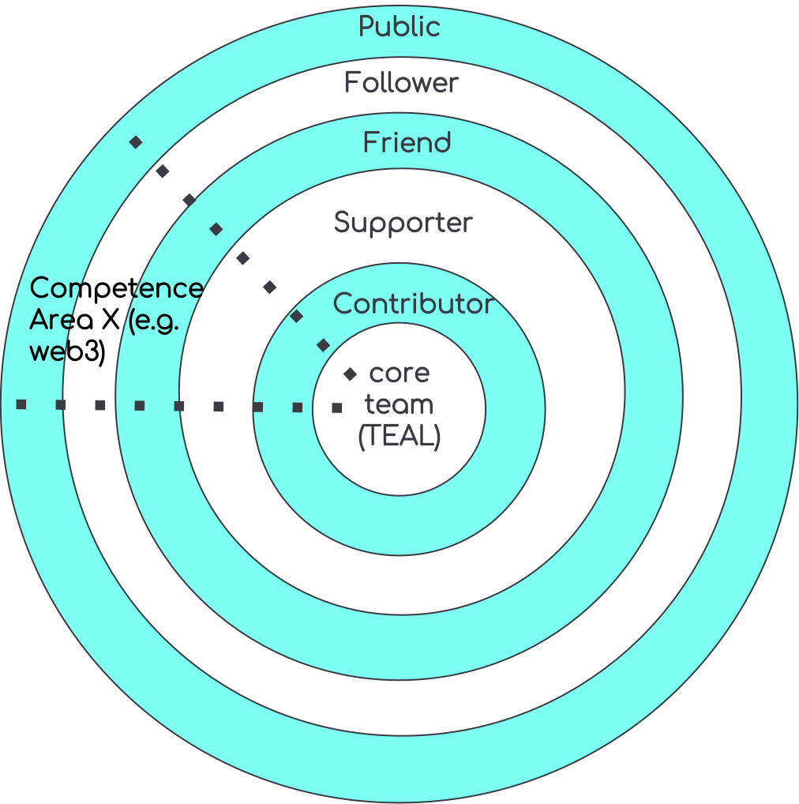

# WHIP-2: WiHi DAO

## Author(s):

[Mark Ballandies](https://twitter.com/BallandiesMC)

## Type

Governance/ Organization

# Abstract 
The WiHi DAO is the organizational structure that the WiHi community gives itself to achieve its vision of facilitating weather and climate predictions anytime anywhere. It follows the principles of collective intelligence and self-organization to manage its complex 3-sided market consisting of weather data providers, data consumers and platform maintainers/ developers/ facilitators. 

# Specification 

The DAO consists of 5 layers, as illustrated in the figure above. The public can join the DAO by following WiHi in one of its channels (e.g. Twitter, Discord, etc.). By starting to interact with members of upper layers in the DAO and/ or by owning WiHi tokens, a follower can become a friend of WiHi. Friends that actively start supporting WiHi by performing dedicated tasks for it success are becoming supporters of WiHi. Those supporters that spend a considerable amount of their time supporting WiHi become contributors. Contributors that take larger responsibility within the DAO can become core team members.

The core team itself is self-organized in areas of competence that radiate out into the other layers.

## Operational Rules:
1. Core team votes to add new core members or remove existing ones;
2. Any core team member can open new competence areas (CA)
3. Competence areas organize themselves
4. CAs can level up members until Contributor level (in the DAO Onion)
5. CAs can grant member access to CA specific communication channels 
5. Anyone is empowered to join any CA as a follower
6. CA manage a (monthly) budget of tokens they can spend (can be 0). Either the CA receives tokens by an entity already owning tokens or requests them via an improvement proposal from the treasury.
7. CA can decide to “outsource” work on a token basis
8. Fiat compensation requires alignment within core team

# Motivation
We recognize that the WiHi system is a complex system (due to its size and inter-dependencies among its components) which can neither be controlled nor governed effectively with traditional hierarchical top-down management or control mechanisms (see [1](https://www.researchgate.net/publication/364949613_Democracy_by_Design_Perspectives_for_Digitally_Assisted_Participatory_Upgrades_of_Society), [2](https://link.springer.com/book/10.1007/978-3-030-62330-2) or [3](https://medium.com/coinmonks/complex-systems-part-2-managing-complexity-with-bottom-up-solutions-9d6fadd88cc4)). Hence, we chose the organizational form of a DAO that empowers community members to act (self-organization) and that can harness the collective intelligence of the members via digital democracy to steer its system parameters and actions. 

