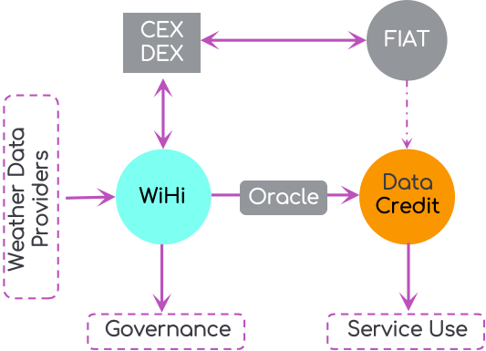
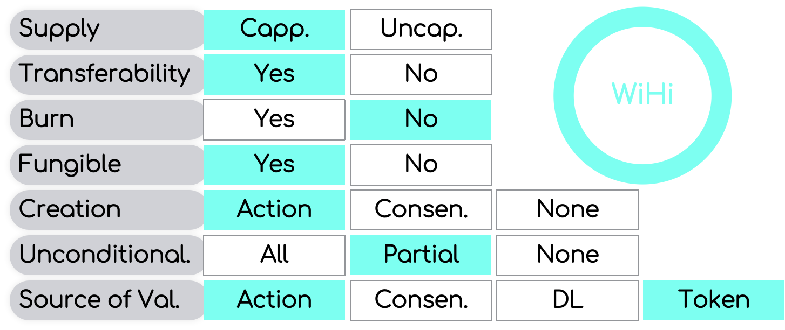

# WHIP-6: Tokenomics

## Author(s)
[Mark Ballandies](https://twitter.com/BallandiesMC)

## Type 
Economic

# Abstract [max 200 words]
This WHIP is about WiHis tokenomics. In particular, it illustrates the token model and the (initial) distribution of token units. 

# Specification

WiHi follows DePIN industry best practice by using a deflationary burn-and-mint token model. 

## Token model

The WiHi token is awarded to weather data providers (refered to in the followin as *miners*) in exchange for the data provided to the platform. The WiHi token gives access to the system governance and the services of the platform. The latter is achieved by letting the swap of WiHi tokens for data credits be the only means to receive those credits in the system, which in turn gives access to the system services. Data credits are a non-transferable token and the swap is performed via an oracle in such a way that the data credits have a fixed price denominated in a FIAT currency (e.g. US Dollar). In this way, the system can guarantee stable in Fiat denominated prices (e.g. a specific quality of data always cost for instance 1 USD). 

In contrast, the WiHi token is freely tradeable at exchanges and thus can be converted to a FIAT currency such as US Dollar.

## Token design

The WiHi token supply is capped at 810 Million

## Token distributio

# Motivation 

# (Rationale [of design decisions within the specification])