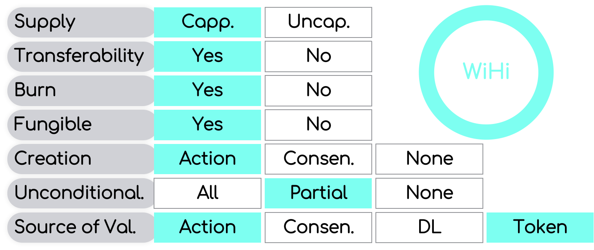

# WHIP-6: Tokenomics

## Author(s)
[Mark Ballandies](https://twitter.com/BallandiesMC)

## Type 
Economic

# Abstract [max 200 words]
This WHIP is about WiHis tokenomics. In particular, it illustrates the token model and the (initial) distribution of token units. 

# Specification

WiHi follows DePIN industry best practice by using a deflationary burn-and-mint token model. 

## Token model and Token design

The WiHi token is awarded to weather and climate data providers (referred to in the following as *miners*) in exchange for the data provided to the platform. The WiHi token gives access to the system governance and the services on the platform. The latter is achieved by letting the swap of WiHi tokens for data credits be the only means to receive credits in the system, which in turn gives access to the system services. The swap is performed via an oracle in such a way that the data credits have a fixed price denominated in a FIAT currency (e.g. US Dollar). 

Data credits are an uncapped non-transferable token that are burned whenever they are used to access system services.

In contrast, the WiHi token is freely tradeable at exchanges and thus can be converted to a FIAT currency such as US Dollar. It is capped in supply, is (partially) burned when swapped to credits, and its creation is bound to performing weather/ climate data sharing actions in the system. The token has value because it gives access to governance and is the only means to access the services of the system.

The WiHi token supply is capped at 540 Million     (2^8 * 3^3 * 5^7 * 7^0 * 11^0 * 13^0 )
The WiHi token supply is capped at 630 Million     (2^7 * 3^2 * 5^7 * 7^1 * 11^0 * 13^0 )
The WiHi token supply is capped at 693 Million     (2^6 * 3^2 * 5^6 * 7^1 * 11^1 * 13^0 )
The WiHi token supply is capped at 720,720 Million (2^7 * 3^2 * 5^4 * 7^1 * 11^1 * 13^1 )
The WiHi token supply is capped at 945 Million     (2^6 * 3^3 * 5^7 * 7^1 * 11^0 * 13^0 )
The WiHi token supply is capped at 1,44144 Billion (2^8 * 3^2 * 5^4 * 7^1 * 11^1 * 13^1 )

## Token distribution

# Motivation
WiHi decided to be a token project. This document facilitates the basis for the first creation of these tokens. The need for having this laid out is currently becoming apparent in the community build-up activities.   

# Rationale 
In this way, the system can guarantee stable in Fiat denominated prices (e.g. a specific quality of data always cost for instance 1 USD). 
Not a stable coin. Etc.
