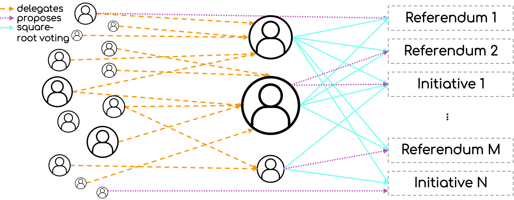

# WHIP-0007: Voting 

## Author(s)
[Mark Ballandies](https://twitter.com/BallandiesMC)

## Type 
Governance
# Abstract

Following the mechanisms outlined in [onocoy's whitepaper](https://static1.squarespace.com/static/6313a587324d1047ec4d9a13/t/64e892a5e6f5d8652a2b925b/1692963500980/20230825_whitepaper_onocoy_final.pdf), this WHIP outlines the principles of WiHi's voting mechanism, where token holders can anonymously delegate tokens to identified delegates who can vote on proposals that can be initiated by all community members. Initially, a super-majority (>66%) is needed for decision-making, with future exploration of alternative voting methods to prevent the "Tyranny of the Majority." This approach aims to attract motivated community members by showcasing their participation in governance. The rationale emphasizes inclusivity, autonomous improvement, and prevention of power concentration. Identifying delegates is essential to prevent fraud and maintain transparency, but minimal criteria will encourage broad participation. Anonymous delegation ensures wide engagement, preserving privacy, and allowing all community members to propose votes. Detailed specifications will follow in future WHIPs.

# Specification 

The figure above illustrates the voting mechanism applied in WiHi. 

Community members who possess WiHi tokens can anonymously delegate their tokens to identified (partially doxed) delegates within the system. 

Delegates use their delegated tokens to vote on proposals, with voting power proportional to the square root of the tokens they control and those which were delegated to them (e.g., 1 token unit equals 1 vote, but 4 token units equal 2 votes, 9 tokens – 3, and so on). 
All community members have the opportunity to submit vote proposals. 

Initially, super majority will be employed for decision-making (>66% of the voting power is required to accept a proposal), but alternative voting mechanisms will be explored in the future to better align with community sentiment and prevent the "Tyranny of the Majority."

This and further specifications of the voting mechanism will be illustrated in greater detail in follow-up WHIPs.

# Motivation
WHIP-1 illustrates the how improvement proposals are currently decided on. In the future the taking of such and similar decisions (e.g. calibration of system parameters) should be extended to all WiHi token holders (in order to harness their collective intelligence). 
This specification illustrates the high-level mechanism of how such votings should be performed. In particular,  it shows the intrinsically motivate individuals of the WiHi community how they will be able to participate in the shaping of the WiHi system.  

# Rationale 

The primary objective of WiHi's voting can be summarized as follows:

1. Inclusion of all stakeholders, including users, in decision-making processes.
2. Facilitation of self-improvement without centralized control.
3. Prevention of power concentration within any individual or group of stakeholders.

Identifying/ doxing delegates' is required to  
- prevent Sybil attacks on the square-root voting (fraudulent voting by distributing once own tokens to several anonymous identities)
- ensure transparency in the allocation of voting power. This transparency allows for the identification of power concentration and the implementation of mitigation strategies, such as forks.

Nevertheless, in order to facilitate broad participation and thus the taking of responsibility, the objective is to establish (minimal) criteria such that a large number of community members become delegates, promoting decentralization. 

Anonymous delegation of voting power enables broad participation in governance and ensures private reasoning, [both crucial for the emergence of collective intelligence](https://medium.com/coinmonks/complex-systems-part-2-managing-complexity-with-bottom-up-solutions-9d6fadd88cc4).

Enabling all community members to submit vote proposals support free expression and broad participation, [both crucial for the emergence of collective intelligence](https://medium.com/coinmonks/complex-systems-part-2-managing-complexity-with-bottom-up-solutions-9d6fadd88cc4).

