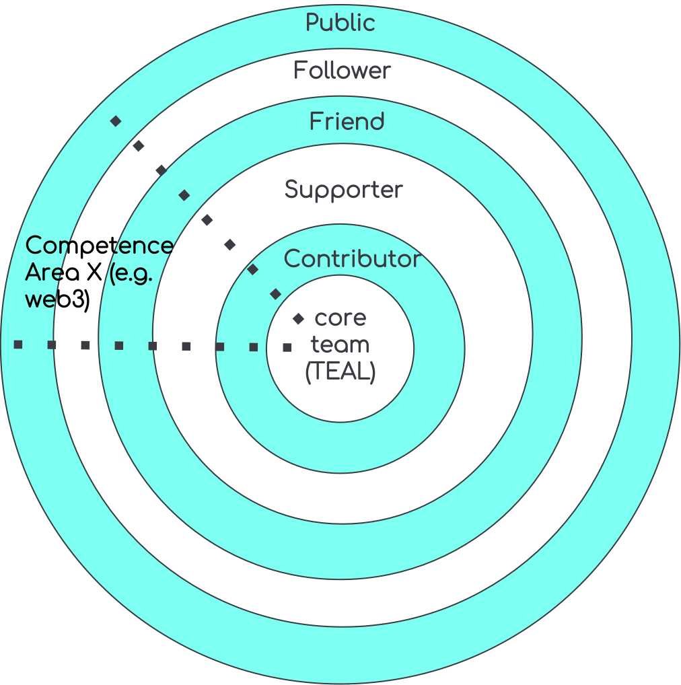

# WHIP-2: WiHi DAO

## Author(s):

[Mark Ballandies](https://twitter.com/BallandiesMC)

## Type

Governance/ Organization

# Abstract 
The WiHi DAO is the organizational structure that the WiHi community gives itself to achieve its vision of facilitating weather predictions everywhere on earth anytime. It follows the principles of collective intelligence and self-organization to manage its complex 3-sided market consisting of weather data providers, data consumers and platform maintainers/ developers/ facilitators. 

# Specification 

The DAO consists of 5 layers, as illustrated in the figure above. The public can join the DAO by following WiHi in one of its channels (e.g. Twitter, Discord, etc.). By starting to interact with members of upper layers in the DAO and/ or by owning WiHi tokens, a follower can become a friend of WiHi. Friends that actively start supporting WiHi by performing dedicated tasks for it success are becoming supporters of WiHi. Those supporters that spend a considerable amount of their time supporting WiHi become contributors. Contributors that take larger responsibility within the DAO can become core team members.

The core team itself is self-organized in areas of competence that radiate out into the other layers.

## Operational Rules:
1. Core team votes to add new core members or remove existing ones;
2. Any core team member can open new competence areas (CA)
3. Competence areas organize themselves
4. CAs can level up members until Contributor level (in the DAO Onion)
5. CAs can grant member access to CA specific communication channels 
5. Anyone is empowered to join any CA as a follower
6. CA manage a (monthly) budget of tokens they can spend (can be 0). Either the CA receives tokens by an entity already owning tokens or requests them via an improvement proposal.
7. CA can decide to “outsource” work on a token basis
8. Fiat compensation requires alignment within core team

## Rights/ obligations
The following table illustrates the rights and obligations of each layer in greater detail. 

|                                            |                                                                                                      _Core_                                                                                                     |                                                                                               _Contributor_                                                                                               |                                                                             _Supporter_                                                                             |                                                                            _Friend_                                                                           |                                              _Follower_                                              |
|:------------------------------------------:|:---------------------------------------------------------------------------------------------------------------------------------------------------------------------------------------------------------------:|:---------------------------------------------------------------------------------------------------------------------------------------------------------------------------------------------------------:|:-------------------------------------------------------------------------------------------------------------------------------------------------------------------:|:-------------------------------------------------------------------------------------------------------------------------------------------------------------:|:----------------------------------------------------------------------------------------------------:|
|                  **Role**                  |                                                                     Has the overall responsibility for platform development and promotion.                                                                      |                                                                     Strong support for core team in one or multiple competence areas.                                                                     |                                                                   Support for one or multiple CA.                                                                   |                    A follower that is friendly towards WiHi  and has shown more than the normal initiative. Or someone owning WiHi tokens.                    | Want to learn more/ are intrigued about WiHi. Anyone can become a follower out of their own power. |
|              **pre-requisite**             | Has been a contributor before and has shown a proven track record of  supporting WiHis vision and mission.  Wants to be faciliator/ executer/  driver/ mediator/ thought leader for  WiHis vision and mission.  | Has either the (technical) capabilities to execute WiHis vision and mission (when coming from outside) or has shown a  proven track of supporting WiHis vision  and mission effectively as a supporter. |                     Has either the (technical) capabilities to support a CA or has shown a proven track record of supporting WiHi as a friend.                    | Signals interest to be closer connected ((e.g. asking good questions, answering other people questions, sharing valuable knowledge, creating memes/code etc.) |                                                 None                                                 |
|           **sub-layer/ persona**           |                                                                                                                                                                                                                 |                                                                                                                                                                                                           |                                                       e.g. ambassadors, advisors, miners, community developer                                                       |                                             e.g., customer/ clients, other friendly DePIN projects, hardware supp.                                            |                                                                                                      |
|               **Activities**               |                                                             Daily contributes to WiHi. Leads CAs, drives important topics internally and externally.                                                            |                                                              Contributes several times a week to WiHi. Covers key competencies within WiHi.                                                             | regularly & pro-actively either i) promotes/ supports WiHi meaningfully and visibly to the outside and/ or ii) extends  WiHis capabilities within the organisation. |                                                               irregularly contributes to WiHi                                                               |                                    Informs him/ herself on WiHi.                                   |
|             **Entry into role**            |                                                                                              Decision by core team.                                                                                             |                                                                                       Decision by Competence area(s)                                                                                      |                                                       Decision by Competence area(s).  Can be automated.                                                       |                                                               Decision by CA. Can be automated.                                                               |                   self-action (by joining discord/ mailing list/ twitter follower)                   |
|              **Fiat possible**             |                                                                                                       Yes                                                                                                       |                                                                                                    Yes                                                                                                    |                                                                                  No                                                                                 |                                                                               No                                                                              |                                                  No                                                  |
|             **Token possible**             |                                                                                                       Yes                                                                                                       |                                                                                                    Yes                                                                                                    |                                                                                 Yes                                                                                 |                                                                               No                                                                              |                                                  No                                                  |
|              **Swag possible**             |                                                                                                       Yes                                                                                                       |                                                                                                    Yes                                                                                                    |                                                                                Maybe                                                                                |                                                                               No                                                                              |                                                  No                                                  |
|  **Access to private core channels**  |                                                                                                       Yes                                                                                                       |                                                                                                    Some                                                                                                   |                                                                                  No                                                                                 |                                                                               No                                                                              |                                                  No                                                  |
|      **Access to private CA channels**     |                                                                                                       Yes                                                                                                       |                                                                                                    Yes                                                                                                    |                                                                                 Some                                                                                |                                                                               No                                                                              |                                                  No                                                  |
| **Access to semi-public discord channels** |                                                                                                       Yes                                                                                                       |                                                                                                    Yes                                                                                                    |                                                                                 Yes                                                                                 |                                                                              Yes                                                                              |                                                  No                                                  |
|    **Access to public discord channels**   |   Yes                                                                                                                                                                                                              |         Yes                                                                                                                                                                                                  | Yes                                                                                                                                                                    |       Yes                                                                                                                                                        |    Yes                                                                                                  |

# Motivation
We recognize that the WiHi system is a complex system (due to its size and interdependencies among its components) which can neither be controlled nor governed effectively with traditional hierarchical top-down management or control mechanisms. Hence, we chose the organizational form of a DAO that empowers community members to act (self-organization) and that can harness the collective intelligence of the members to steer its system parameters and actions. 

